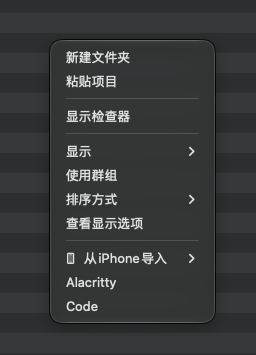

# Finder Actions

[English](README.md) | 简体中文

Finder Actions 为 macOS Finder 增加实用的右键功能。你可以在 Finder 的空白区域、文件或文件夹上点击右键，然后使用 Alacritty、Visual Studio Code 或自己添加的脚本处理当前位置。



应用默认提供：

- **Alacritty**：在当前文件夹打开 Alacritty。
- **Code**：在当前文件夹打开 Visual Studio Code。
- **自定义脚本**：按自己的需要增加更多右键功能。

支持 macOS 13 Ventura 或更高版本。

## 安装

1. 从 [Releases](../../releases) 下载最新的 `Finder-Actions-<版本>.zip`。
2. 解压后，将 `Finder Actions.app` 移动到“应用程序”文件夹。
3. 打开“终端”，运行：

   ```bash
   xattr -dr com.apple.quarantine "/Applications/Finder Actions.app"
   ```

4. 打开一次 Finder Actions。macOS 首选语言为中文时显示中文，其他系统语言均显示英文。
5. 前往“系统设置 → 通用 → 登录项与扩展 → Finder 扩展”，启用 **FinderActionsExtension**。
6. 回到 Finder。如果右键功能没有立即出现，请重新打开 Finder：

   ```bash
   killall Finder
   ```

Finder Actions 不需要加入登录项，也不需要保持窗口打开。请不要删除或移走“应用程序”文件夹中的 App，否则 Finder 扩展将无法使用。

## 设置右键功能

打开 Finder Actions 后：

1. 在“选择右键功能”中查看当前已经启用的功能。
2. 点击“添加右键功能”，加入尚未启用的功能。
3. 拖动功能右侧的三横线把手，调整它在 Finder 右键菜单中的顺序。
4. 点击功能右侧的减号，将它从 Finder 右键菜单移除。

排序和其他功能列表变化会自动保存，通常不需要重新打开 Finder。移除功能不会删除对应脚本，以后仍可重新添加。

如需覆盖系统语言，请展开设置窗口底部的 **Language / 语言**，然后选择英文或简体中文。手动选择会被记住，并且优先于之后的系统语言变化。

## 设置显示位置

在“选择显示位置”中决定右键功能可以在哪里出现：

- 点击“添加位置”选择一个或多个文件夹。
- 点击位置右侧的减号停止监控该位置。
- 点击“使用推荐位置”恢复个人文件夹、外置磁盘和“应用程序”文件夹。

右键功能也会出现在所选位置的子文件夹中。修改位置后，请点击“应用位置更改”或“应用并完成”，应用会自动重新打开 Finder。

对于外置磁盘，建议添加 `/Volumes`，不要逐个添加具体宗卷。这样新连接的磁盘也能正常使用右键功能。

## 使用右键功能

- 右键文件夹：脚本收到该文件夹的绝对路径。
- 右键文件：脚本收到该文件的绝对路径。
- 右键 Finder 空白区域：脚本收到当前文件夹的绝对路径。

默认的 Alacritty 和 Code 功能会在目标是文件时自动使用文件所在的文件夹。

## 添加自己的脚本

只添加来源可信的脚本。

在“添加右键功能”中选择“添加自定义脚本”，应用会复制脚本并自动设置运行权限。脚本需要满足以下格式：

```bash
#!/bin/bash
# 这里填写中文功能说明
# Describe this action in English
```

- 文件名去掉最后一个后缀后，就是右键菜单名称。例如 `New Text.sh` 显示为“New Text”。
- 第一行必须是 Shebang。
- 第二行是可选的中文功能说明。
- 第三行是可选的英文功能说明。
- 两种说明可以同时省略。如果只填写英文说明，第二行需要保留一个空的 `#` 注释。
- Finder 中的目标绝对路径通过第一个参数 `$1` 传给脚本。

也可以通过“添加右键功能 → 打开脚本文件夹”管理脚本。手动新增或修改后，点击同一菜单中的“刷新功能列表”。不符合格式或安全要求的文件会被自动忽略。

## 常见问题

### 右键菜单没有出现

依次检查：

1. 系统设置中是否已经启用 **FinderActionsExtension**。
2. 当前目录是否位于应用设置的显示位置中。
3. 是否安装过会接管 Finder 右键菜单的其他扩展，例如 Keka。
4. 当前目录是否由 iCloud Drive、OneDrive 等云盘管理。

macOS 可能优先使用其他 Finder 扩展或云盘扩展。可以暂时关闭相关扩展后运行 `killall Finder` 再试。Finder Actions 无法在被 File Provider 完全接管的目录中强制显示菜单。

如果以前安装过 `Alacritty.workflow` 或 `Code.workflow`，请从 `~/Library/Services` 删除它们，避免出现名称相同的旧菜单。

### 外置磁盘在收藏栏中的图标变了

Finder 会为扩展直接监控的位置显示 Finder Actions 图标。跨宗卷稳定显示右键功能和完全保留宗卷原始动态图标无法同时保证。

如果希望收藏栏显示普通图标，可以创建宗卷的软链接，再收藏该软链接：

```bash
ln -s /Volumes/pd ~/pd-link
```

请按实际宗卷名称修改命令，并确认目标链接尚不存在。

### 如何生成诊断日志

展开应用底部的“右键菜单没有出现？”，开启“收集问题诊断信息”，然后重新操作一次出现问题的右键功能。

点击“将诊断日志保存到桌面”后，将生成的 `Finder-Actions-Diagnostics-<时间>.log` 发给开发者。日志可能包含本机文件路径和脚本输出，发送前可以先用文本编辑器检查。问题解决后建议关闭诊断开关。

## License

[MIT](LICENSE)
